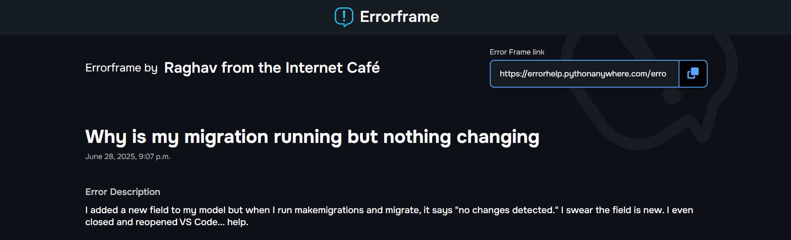
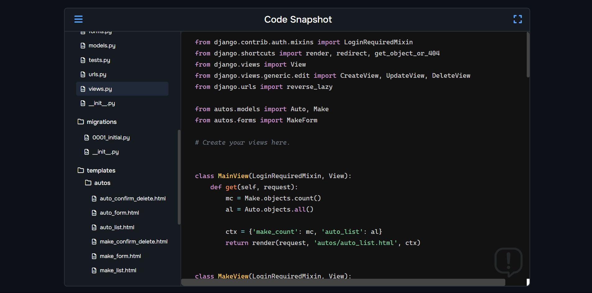
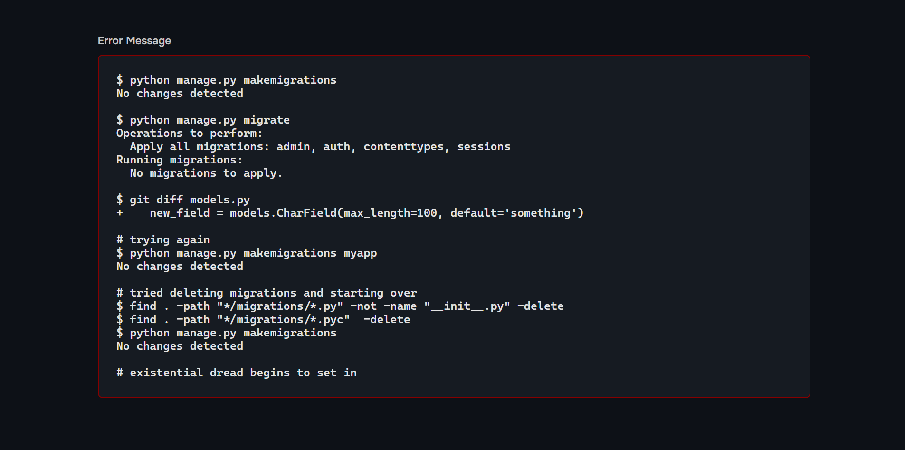
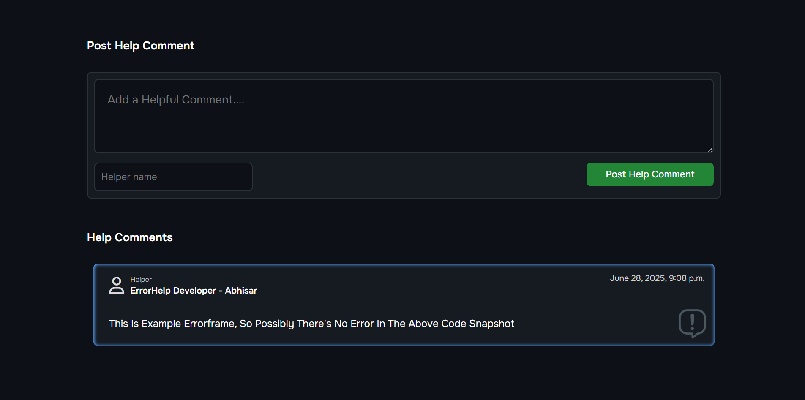
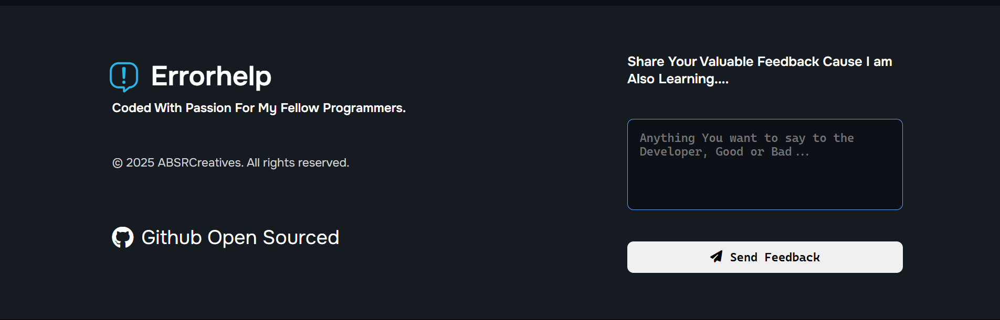

# ERRORHELP

> *"I couldn't watch my fellow developers share error screenshots and then code also asking for help in the community chats, so I created this web app where they can put the code snapshot and error terminal message and more about the error at one place and share link everywhere."*

**I started programming 6 months back and this is my first Full Stack Webapp.**

**Errorhelp lets you create an Errorframe and share it with helpers so that they can assist you until the bug is fixed.**

### [Go To Errorhelp Live Webapp](https://errorhelp.pythonanywhere.com)

---

## 🧩 Every Errorframe Has:

1. **🧠 The Error-Causing Code Snapshot**

   * All relevant code files that are causing the error, displayed in a clean VS Code-like viewer so helpers can easily understand the context.

2. **💥 The Error Terminal Message**

   * The terminal message is shown so helpers can trace and debug faster.

3. **📝 The Error Description**

   * The creator can describe what they were trying to do or provide any context that might help fix the bug.

4. **💬 Help Comment Section**

   * Developers visiting the Errorframe can leave comments and suggestions to help fix the error.

---

## 📁 Smart Uploading

> While uploading code files, Errorhelp automatically discards unnecessary folders like `.git`, `__pycache__`, and others you don't need to worry about.

---

## 🔗 Deletion by URL

After creating an Errorframe, you receive two URLs:

* One for sharing.
* One for deletion.

When you visit the deletion URL, your Errorframe is instantly deleted. The page shows your Errorframe title and creator name for confirmation.

---

## 🏠 Example Errorframe

From the home page, you can click a button to see an example Errorframe and understand how everything works.

---

## 📸 Screenshots

---

## 🛠 Tech Stack

* **HTML**
* **CSS** (Traditional CSS, no frameworks)
* **JavaScript** (Vanilla, no frameworks)
* **Python** (Django Backend)
* **PythonAnywhere** (For Hosting)

---

## 💬 Note

I am also learning, so if you find any bugs or anything that could be improved, feel free to share your feedback in the footer section's review box. It will send your message directly to my email. ✉️

---

<h1 style="text-align: center; margin-top: 30px;">🙏 THANK YOU</h1>
